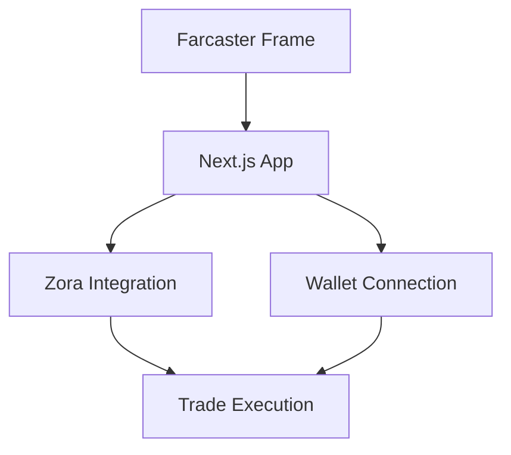

# 🖼️ Farcaster Frames v2 Project

A Farcaster Frames v2 implementation showcasing interactive frame capabilities with Zora integration.

## Documentation

Detailed documentation is split into separate files for better organization:

- [Farcaster Integration](./docs/FARCASTER.md) - Details on Frame v2 implementation and features
- [Zora Integration](./docs/ZORA.md) - Documentation for Zora SDK integration and trading features

## Authentication Flow

The app uses Sign in with Farcaster (SIWF) to authenticate users and connect their wallet for Zora transactions:

1. When a user interacts with the frame, the app requests SIWF credentials using `sdk.actions.signIn()`
2. The SIWF message and signature are verified on the server
3. Once authenticated, the user's Farcaster identity is used to:
   - Connect their wallet for Zora transactions
   - Track trading history
   - Enable frame notifications

This authentication flow ensures secure token trading while maintaining a seamless user experience within the Farcaster client.

## How It Works

This app combines Farcaster Frames v2 with Zora's SDK to create an interactive token trading experience:

1. Users interact with the Frame through Farcaster clients
2. Frame interactions trigger token trading interfaces
3. Zora SDK handles token operations and pricing
4. Wallet connections manage transaction signing

See individual documentation files for detailed implementation specifics.

## 🛠️ Core Components

### Frame SDK Integration
The project uses `@farcaster/frame-sdk` and related packages which provide:
- Frame context management
- Action handlers
- Wallet interactions
- Notification system

### Key Dependencies
```json
{
  "@farcaster/auth-kit": "^0.6.0",
  "@farcaster/frame-core": "^0.0.29",
  "@farcaster/frame-node": "^0.0.18",
  "@farcaster/frame-sdk": "^0.0.31",
  "@farcaster/frame-wagmi-connector": "^0.0.19",
  "@radix-ui/react-label": "^2.1.1",
  "@tanstack/react-query": "^5.61.0",
  "@upstash/redis": "^1.34.3",
  "@zoralabs/coins-sdk": "latest",
  "next": "15.0.3",
  "wagmi": "^2.14.12",
  "viem": "^2.23.6"
}
```

## 🏗️ Project Structure

```
src/
├── app/                    # Next.js app directory
│   ├── frames/            # Frame-specific routes
│   │   └── token/        # Token-specific frame routes
│   └── .well-known/      # Farcaster configuration
├── components/            # React components
│   ├── hooks/            # Custom React hooks
│   ├── providers/        # React context providers
│   └── ui/              # UI components
└── lib/                  # Utility functions
```

## 🔑 Current Features

### 1. Frame Configuration
- Frame metadata and routing in `src/app/frames/token/[chainId]/[address]/`
- OpenGraph image generation
- Token display and interaction

### 2. Zora Integration
Currently implemented features:
- Token information fetching with optimized images
- Buy/Sell functionality with slippage protection
- Price impact protection and error handling
- Image optimization with blurhash and Next.js

### 3. Wallet Integration
Implemented via Wagmi:
- Wallet connection/disconnection
- Transaction handling
- Chain switching
- Balance checking

### 4. UI Components
- Modern, responsive design
- Interactive trade modal
- Token information display
- Transaction status indicators

## 🏗️ System Architecture

### Core Integration Flow


### Key Integration Points
- **Frame-to-App Communication**: Handled via `@farcaster/frame-sdk`
- **Zora Integration**: Managed through `@zoralabs/coins-sdk`
- **Wallet Integration**: Implemented via `wagmi` and `viem`
- **State Management**: React hooks and context

## 🧩 Core Components

### Frame Components
- `Demo.tsx`: Main frame component handling trade interface and interactions
  - Manages trade modal and overlay system
  - Handles wallet connection flow
  - Implements buy/sell functionality
- `AddFrameButton.tsx`: Handles frame subscription and notifications
  - Manages frame metadata
  - Handles notification permissions

### Integration Components
- `WagmiProvider.tsx`: Configures wallet connections and chain settings
  - Sets up supported chains
  - Configures RPC endpoints
  - Manages wallet connections
- `useZoraCoin.tsx`: Custom hook managing Zora token interactions
  - Fetches token information
  - Handles trade execution
  - Manages token state

### UI Components
- Trade modal with buy/sell interface
- Token information display
- Transaction status notifications
- Responsive overlay system

## 📊 State Management

### Key State Objects
- **Trade State**: Manages buy/sell amounts and transaction flow
  ```typescript
  const [buyAmount, setBuyAmount] = useState<string>('');
  const [sellAmount, setSellAmount] = useState<string>('');
  ```
- **UI State**: Controls modal visibility and animations
  ```typescript
  const [isOverlayVisible, setIsOverlayVisible] = useState(false);
  const [isTradeVisible, setIsTradeVisible] = useState(false);
  ```
- **Wallet State**: Tracks connection status and balances
  ```typescript
  const { address, isConnected } = useAccount();
  const { data: ethBalance } = useBalance({...});
  ```
- **Token State**: Maintains token information and pricing
  ```typescript
  const { coinDetails, onchainDetails } = useZoraCoin(targetCoinAddress);
  ```

### State Flow
1. User initiates action (buy/sell/connect)
2. State updates trigger UI changes
3. External calls execute (Zora/wallet)
4. Results update relevant state

## 🔧 Development Patterns

### Error Handling
- Centralized error management via toast notifications
- Transaction error recovery
- Network error handling
- Custom error hooks for consistent handling

### Animation System
- CSS keyframe animations for modals
- State-based animation triggers
- Transition management
- Smooth UI transitions

### API Integration Pattern
- Async operation wrapper pattern
- Error boundary implementation
- Loading state management
- Rate limiting and retry logic

## 🧪 Testing Strategy

### Unit Tests
- Component rendering tests
  - Modal behavior
  - Button interactions
  - Form validation
- Hook behavior tests
  - State management
  - Side effects
  - Error handling
- Utility function tests
  - Format functions
  - Calculations
  - Validation

### Integration Tests
- Frame interaction tests
  - Frame loading
  - User interactions
  - State transitions
- Wallet connection flow
  - Connection states
  - Network switching
  - Balance updates
- Trade execution flow
  - Order creation
  - Transaction signing
  - Confirmation handling

### E2E Tests
- Full user journey tests
  - Connect wallet
  - Execute trade
  - Handle notifications
- Frame-to-trade flow
  - Frame initialization
  - Trade completion
  - Success/failure states
- Error scenarios
  - Network errors
  - Transaction failures
  - Invalid inputs

## 🔍 Troubleshooting Guide

### Common Issues
1. Frame not loading
   - Check SDK initialization
   - Verify frame metadata
   - Confirm URL configuration
   
2. Trade failures
   - Verify token contract
   - Check slippage settings
   - Confirm gas settings
   
3. Wallet connection issues
   - Confirm chain configuration
   - Check wallet compatibility
   - Verify network status
   
4. Image loading issues
   - Check mediaContent structure in API response
   - Verify image URLs are accessible
   - Confirm Next.js Image component configuration
   - Check if blurhash is available for optimization

## 📝 Implementation Examples

### Zora Hook Implementation
```typescript
// src/components/hooks/useZoraCoin.ts
export function useZoraCoin(coinAddress: `0x${string}`) {
  const [coinDetails, setCoinDetails] = useState<any>(null);
  const [onchainDetails, setOnchainDetails] = useState<any>(null);
  const [isLoading, setIsLoading] = useState(false);
  const [error, setError] = useState<Error | null>(null);

  const getCoinInfo = useCallback(async () => {
    setIsLoading(true);
    setError(null);
    try {
      const [details, onchainData] = await Promise.all([
        fetchCoinDetails(coinAddress),
        address ? fetchOnchainCoinDetails(coinAddress, address, publicClient) : null
      ]);
      setCoinDetails(details);
      setOnchainDetails(onchainData);
    } catch (err) {
      setError(err instanceof Error ? err : new Error('Unknown error'));
    } finally {
      setIsLoading(false);
    }
  }, [coinAddress, address, publicClient]);

  // ... trade implementation
}
```

### Core Zora Functions
```typescript
// src/lib/zora.ts
export async function executeTrade(
  direction: 'buy' | 'sell',
  targetCoinAddress: `0x${string}`,
  orderSize: bigint,
  recipient: `0x${string}`,
  walletClient: WalletClient, 
  publicClient: PublicClient,
  slippageTolerance = DEFAULT_SLIPPAGE
) {
  try {
    const minAmountOut = calculateMinAmountOut(direction, orderSize, slippageTolerance);
    return await tradeCoin(
      {
        direction,
        target: targetCoinAddress,
        args: {
          recipient,
          orderSize,
          minAmountOut,
          tradeReferrer: PLATFORM_REFERRER,
        }
      }, 
      walletClient, 
      publicClient
    );
  } catch (error) {
    console.error("Error executing trade:", error);
    throw error;
  }
}
```

## 🚀 Getting Started

1. Install dependencies:
```bash
yarn install
```

2. Set up environment variables:
```bash
cp .env.example .env
```

Required variables:
- `NEXT_PUBLIC_URL`: Your app's public URL
- `KV_REST_API_TOKEN`: For notifications (optional)
- `KV_REST_API_URL`: For notifications (optional)

3. Run development server:
```bash
yarn dev
```

4. For testing with Warpcast:
- Use ngrok or similar for public access
- Visit the [Frame Playground](https://warpcast.com/~/developers/frame-playground)

## 🎯 Planned Features

### 1. Advanced State Management
- Implementation of a proper state machine
- More sophisticated state transitions
- Better transaction tracking

### 2. Enhanced Error Handling
- More specific error types
- Retry logic for failed requests
- Better error recovery strategies

### 3. Performance Optimizations
- Request batching
- Proper rate limiting
- Data prefetching
- Caching implementation

### 4. Testing Suite
- Unit tests for core functionality
- Integration tests for frame interactions
- End-to-end testing

### 5. Advanced Trading Features
- Limit orders
- Price feeds
- Advanced market analysis
- Token metadata management

## 📚 Resources

- [Frame Playground](https://warpcast.com/~/developers/frame-playground)
- [Frame SDK Documentation](https://github.com/farcasterxyz/frames/)
- [Developer Preview Docs](https://github.com/farcasterxyz/frames/wiki/frames-v2-developer-playground-preview)
- [Zora SDK Documentation](https://docs.zora.co/docs/smart-contracts/zora-coins-sdk)

## 🤝 Contributing

Contributions are welcome! Please read our contributing guidelines before submitting PRs.

## 📄 License

This project is licensed under the MIT License - see the LICENSE file for details.
